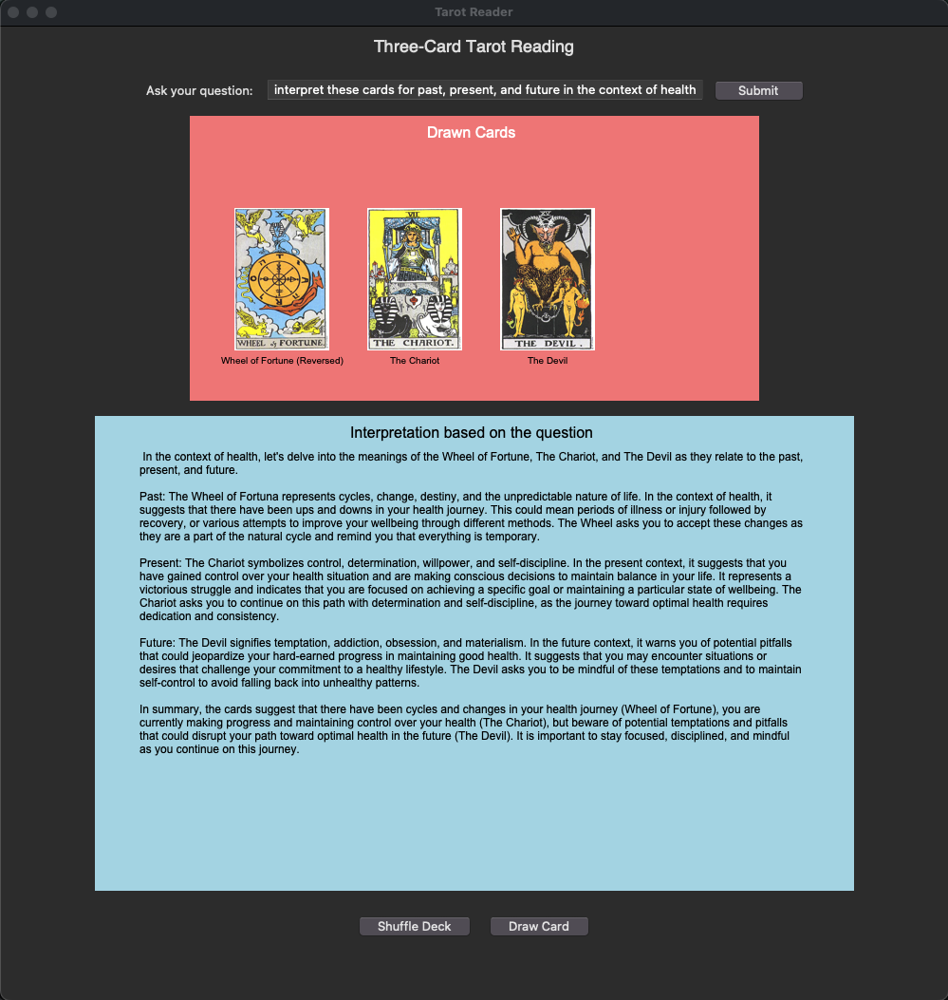

# AI Tarot Reader Desktop APP

## Description

This project is using LLM as a tarot reader. It is a desktop app which is connected to a local running LLM. So, the data never leaves the owners computer. You can ask any question you like and you will get honest answers through magical interpretation of the cards.

## Getting Started

### Dependencies

* Ollama
* Python
* Any LLM which is installed via ollama

### Installing

* Install Ollama:
```$ curl -fsSL https://ollama.com/install.sh | sh```
* Install an LLM with Ollama CLI:
```$ ollama pull mistral```

### Executing program

1. Run Ollama:
 ``` ollama serve```
2. Install requirements:
```pip install -r requirements.txt```
3. Run the Application:
``` python3 main.py ```



## Acknowledgments

* Tarot Cards: [data.totl.net](https://data.totl.net/tarot-rwcs-images/)
